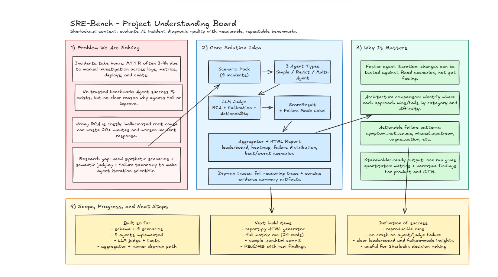
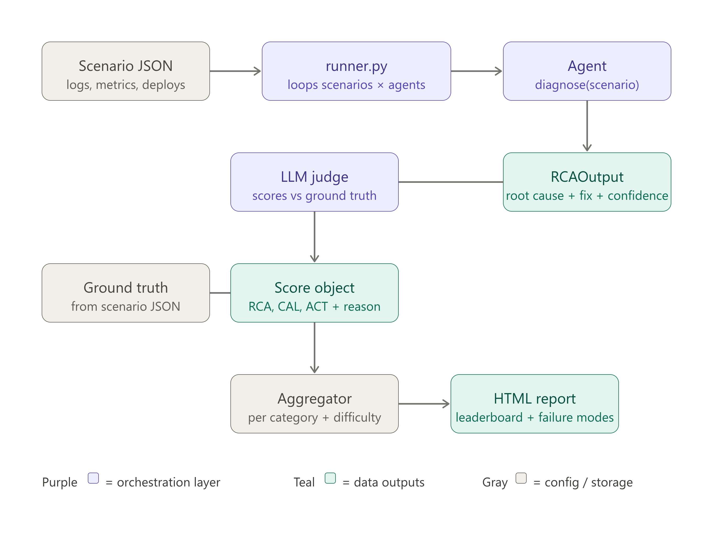
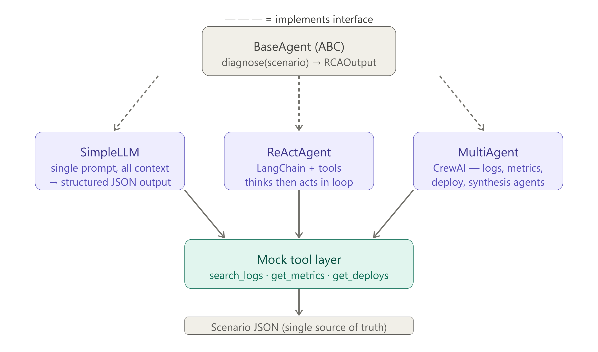
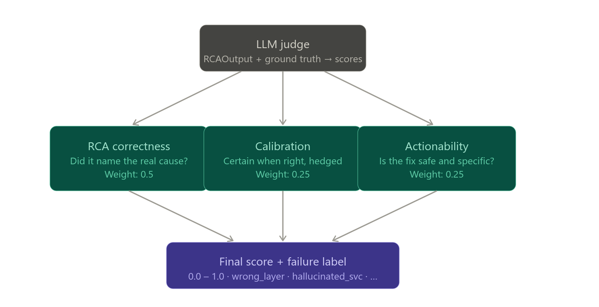

# SRE-Bench (Sherlocks SRE Validator)

Benchmark how well AI agents diagnose production incidents using synthetic scenarios with known ground truth.

SRE-Bench evaluates multiple agent architectures (single-prompt, ReAct, multi-agent) on the same incident set, scores their RCA quality with an LLM judge, and aggregates results into decision-ready analytics.

## Why this exists

In incident response, a wrong root-cause guess is expensive. Teams need a repeatable way to answer:

- Which agent architecture performs best overall?
- Which architecture works better by incident type (K8s/DB/deploy/cascade)?
- What failure modes are most common (symptom-not-cause, missed-upstream, vague-action)?


SRE-Bench provides a reproducible harness to answer these with metrics, not intuition. Better incident agents are not only about swapping to a stronger model; prompting strategy, tool use, and reasoning behavior also matter. This project makes those trade-offs measurable.

## Architecture

### Project overview



### End-to-end data flow



### Agent layer



### Judge rubric



## Repository layout

```text
sre_bench/
  schema.py                # Pydantic contracts
  runner.py                # CLI orchestration (run/report)
  report.py                # HTML report renderer
  agents/
    base.py
    simple_llm.py
    react_agent.py
    multi_agent.py
  evaluators/
    judge.py
    aggregator.py

scenarios/                 # 8 benchmark incident scenarios
results/                   # run outputs + traces + report
tests/                     # schema/judge/runner tests
```

## Scoring model

Each `(scenario, agent)` output is judged on:

- `RCA correctness` (weight `0.50`)
- `Calibration` (weight `0.25`)
- `Actionability` (weight `0.25`)

`final_score = 0.5 * rca + 0.25 * calibration + 0.25 * actionability`

Judge also assigns a failure-mode label from taxonomy (for example: `missed_upstream`, `symptom_not_cause`, `vague_action`).

## Prerequisites

- Python `3.11+`
- OpenAI API key

Optional:

- Anthropic API key (if you extend judge/agents to use Claude models)

## Build and run (from scratch)

### 1) Clone and install

```bash
git clone https://github.com/akshatladdha16/sherlocks-sre-validator
cd sherlocks-sre-validator
python -m venv .venv
source .venv/bin/activate
pip install -r requirements.txt
pip install -e .
```

### 2) Configure environment

```bash
cp .env.example .env
```

Set values in `.env`:

```env
OPENAI_API_KEY=your_key
ANTHROPIC_API_KEY=
JUDGE_MODEL=gpt-4o
AGENT_MODEL=gpt-4o-mini
```

### 3) Validate setup

```bash
pytest tests/ -v
```

### 4) Run a cheap smoke test

```bash
sre-bench run --dry-run --agents simple_llm --scenarios k8s_oom_easy
```

Note: the runner automatically creates `results/` and trace subfolders if they do not exist.

### 5) Run full benchmark matrix

```bash
sre-bench run --agents all --scenarios all
```

By default this evaluates `3 agents x 8 scenarios = 24` judged runs.

### 6) Generate HTML report

```bash
sre-bench report --input results/run_<timestamp>.json --output results/sample_run.html
```

## CLI usage

### `run`

```bash
sre-bench run [OPTIONS]
```

Key options:

- `--agents`: comma list or `all` (`simple_llm,react_langchain,multi_agent_crewai`)
- `--scenarios`: comma list or `all`
- `--output`: custom output JSON path
- `--dry-run`: execute a single scenario-agent pair and print detailed output
- `--no-judge`: skip LLM judge and store only raw RCA outputs

### `report`

```bash
sre-bench report --input <run_json> --output <report_html>
```

## Outputs

After each run:

- `results/run_<timestamp>.json` - full run payload
- `results/traces/full/*.txt` - full reasoning trace artifacts
- `results/traces/summary/*.json` - concise evidence summaries

Generated results artifacts (`results/*.json`, `results/*.html`, `results/traces/*`) are gitignored by default, except `results/sample_run.html` for sharing a sample report.

Report output:

- `results/sample_run.html` (or custom output path)

## Extending SRE-Bench

### Add a new scenario

1. Add JSON to `scenarios/`
2. Ensure it validates against `Scenario` in `sre_bench/schema.py` , can update this schema as per your agent requiremnet and what kind of metrics you want to capture from the production logs. 
3. Run `pytest tests/test_schema.py -v`

### Add a new agent

1. Implement `BaseAgent`
2. Return valid `RCAOutput`
3. Register in `build_agent_registry()` in `sre_bench/runner.py`

## Current status

- Core harness implemented (schema, 3 agents, judge, aggregator, runner, report)
- Tests passing for schema/judge/runner
- Ready for full benchmark runs and README findings update with real numbers
